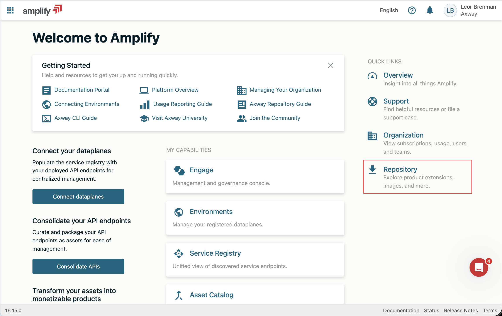
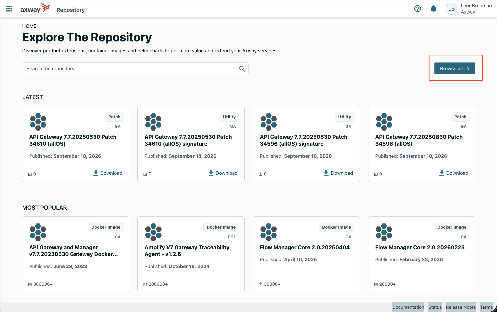
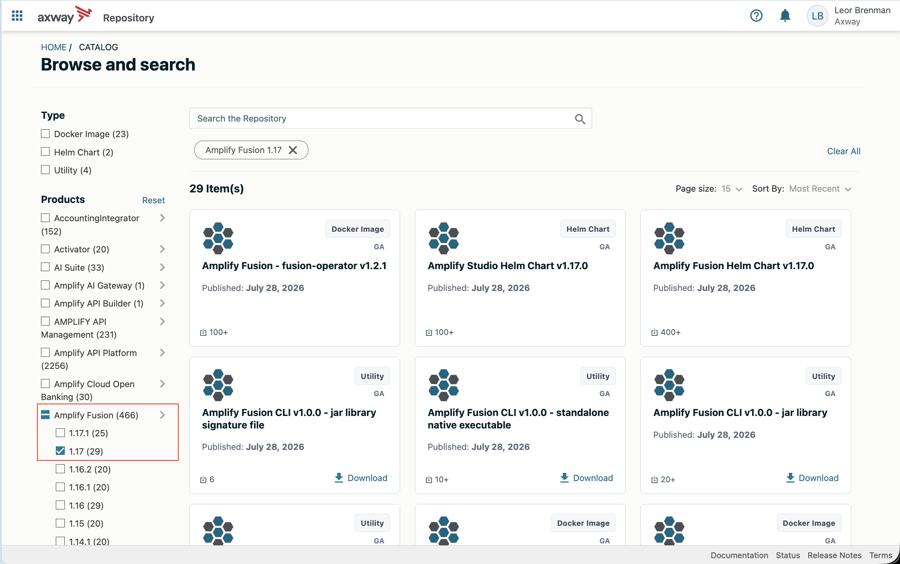
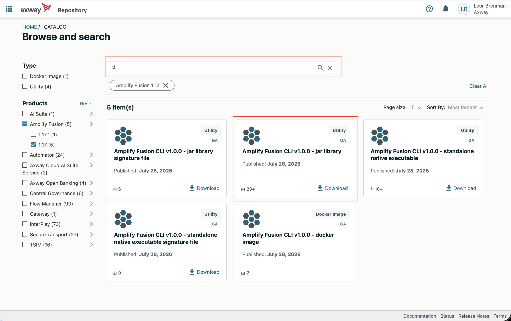
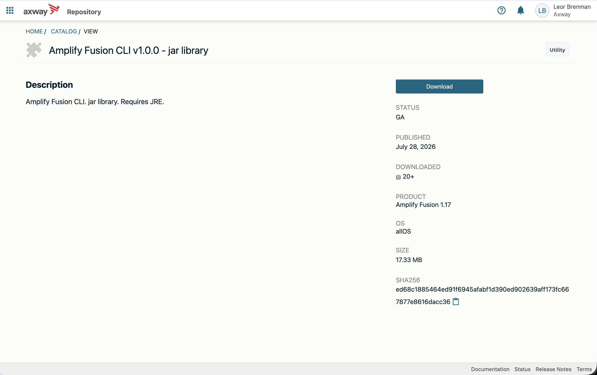

# CLI Lab

In these labs, we will install and exercise the CLI leading to a deployment script which will promote the project from the Deployment Lab to CHECK or LIVE. At the end of these labs, you will learn the following:

* How to install the CLI
* How to run basic CLI commands
* How to create and run a deployment script

Note that the same user can only be logged in once so that when you authenticate with the CLI, your UI session will end and vice versa.

## Pre-requisites

* Access to Amplify Integration
  > If you do not have an account and need one, please send an email to **[amplify-fusion-training@axway.com](mailto:amplify-fusion-training@axway.com?subject=Amplify%20Fusion%20-%20Training%20Environment%20Access%20Request&body=Hi%2C%0D%0A%0D%0ACould%20you%20provide%20me%20with%20access%20to%20an%20environment%20where%20I%20can%20practice%20the%20Amplify%20Fusion%20e-Learning%20labs%20%3F%0D%0A%0D%0ABest%20Regards.%0D%0A)** with the subject line `Amplify Integration Training Environment Access Request`
* Access to the CLI in the Amplify Platform Repository at [https://platform.axway.com](https://platfom.axway.com)
* Java 25, or later installed
* Completion of the Axway University [Amplify Fusion Deployment Course and Lab](https://university.axway.com/learn/courses/14087/amplify-fusion-api-management/lessons/32676/introduction-afapim01)
* Access to curl (or Postman)
* Suitable role to create and run deployment jobs
  > **Note**: You will need Manager role privileges to create deployment jobs in Design mode and deploy to CHECK and/or LIVE and activate your integrations in CHECK and/or LIVE. If you run into permission issues during deployment, please reach out to your environment administrator to update your role accordingly. Full Manager access or Admin access should be sufficient.

## Lab 1

In this lab we'll install the CLI and authenticate

* Log into the Axway Platform at https://platform.axway.com and click on Repository and click Browse all

  
  

* Under Type, scroll down to products and select Amplify Fusion and optionally a version​

  

* Search for CLI to see download options and select the JAR Library​

  
  

* Change directory to the directory where the JAR file downlaoded to and run the CLI using `java -jar fusion-cli-{VERSION}-runner.jar --version`

  > NOTE: Replace {VERSION} with the downloaded version (e.g. 1.0.0)

* Optionally set an alias to the downloaded JAR file using `alias fusion="java -jar /path/to/fusion-cli-{VERSION}-runner.jar"`

  > NOTE: Replace with the path to the CLI JAR file you just downloaded (e.g. `alias fusion="java -jar /Users/leorbrenman/Downloads/fusion-cli-1.0.0-runner.jar"`)

  * Change directory to another directory that DOES NOT contain the CLI and test the alias using `fusion --version`

* Login using `fusion auth login --url https://<your-tenant-url>` (e.g. `fusion auth login --url https://axway-appc-se.sandbox.fusion.services.axway.com/`)

  > NOTE: On success, you should see a message like this `Welcome Leor Brenman GM!. You are now set to use Amplify Fusion operations.`

* Run whoami using `fusion auth whoami` to see a respoinse similar to below:

  ```bash
  First Name          : Leor
  Last Name           : Brenman GM
  Email               : leor.brenman@gmail.com
  Status              : ACTIVE
  Organization Name   : Axway Appcelerator SE
  Tenant Name         : axway-appc-se
  Preferred teams     : Default Team
  All teams           : Default Team
  Default Mode        : DESIGN
  Administrator       : false
  Team Administrator  : false
  Super Administrator : true
  ```

## Lab 2 - Core Commands

In this lab we'll exercise some of the core commands

* Get a listing of your projects using `fusion project get`

* Repeat using the output option using `fusion project get -o json`

* Display the current active environment for your session using `fusion environment pwe`

* Change the current active environment for your session using `fusion environment switch -n CHECK`

* Display the current active environment for your session

* Activate an integration using `fusion project event enable -n $PROJECT -in $INTEGRATION -cn $DATAPLANE`
  * For example: `fusion project event enable -n LBclitest -in flow1 -cn "Shared Data Plane"`
  > NOTE that if a value has spaces, you should enclose in double quotes

* Log into the Fusion UI to confirm that the integration is activated

* Log into the CLI again

* Deactive the same integration

* Log into the Fusion UI to confirm that the integration is deactivated

* While logged into the Fusion UI, go to the deployment job project and note any version that exists (e.g. V2)

* Log into the CLI again

* Create a deployment job using `fusion deployment create -n DJTest -d "DJTest" -pv $PROJECT$,$VERSION$`
  * For example: `fusion deployment create -n DJTest -d "DJTest" -pv LBclitest,V65`

* Log into the Fusion UI to confirm that the deployment job was created

At this point, you now know most if not all of the commands used in a deployment pipeline.

## Lab 3 - Deployment Script

* Download the deployment script example [here](https://raw.githubusercontent.com/Axway-University-1/amplify-fusion-labs-au/main/cli/assets/deployment_script_simple.sh)

* Make it executable using `chmod +x deployment_script_simple.sh`

* Open in an editor and review the instruction and cli commands

* Log into the Fusion UI and create a new version of the deployment job integration and version it and note the project name, integration name, version and data plane name

* Run the deployment script using `./deployment_script_simple.sh` and enter your login credentials, project name, integration name, ...
  * For version, provide the full version (e.g. V17) and not just the number (e.g. 17)

* Test the new version of your integration in the target environment

## Lab 4 - Challenge yourself!

In this lab, you will explore connection overrides and add that to the script so that the HTTP Server credentials can be updated through a CI/CD pipeline.

Hints:
* An HTTP Server connection override [export file](https://raw.githubusercontent.com/Axway-University-1/amplify-fusion-labs-au/main/cli/assets/http_server_override.json) and a revised [import file](https://raw.githubusercontent.com/Axway-University-1/amplify-fusion-labs-au/main/cli/assets/http_server_override_modified.json) are provided as examples
* You need to add two new script inputs for the HTTPS connection Basic auth username and password