# Protecting a Fusion API with OAuth 2.0 and Keycloak

## Introduction

In these labs, we will secure an Amplify Fusion API using OAuth 2.0, with [Keycloak](https://www.keycloak.org/) acting as the identity provider (IdP). Once complete, every call to the protected API must carry a valid access token (JWT) issued by Keycloak, otherwise Fusion rejects the request.

### Our use case - the Employee Directory API

You work for a mid-sized company. HR maintains employee records - name, title, department, email, and phone - and the internal apps team wants a simple REST API to look those up for the org chart, the desk-booking tool, and the on-call scheduler.

You will build an **Employee Directory API** in Fusion Designer with two read operations:

- `GET /employees` - list employees
- `GET /employees/{id}` - get one employee's details

The catch: employee data is sensitive (personal contact info, reporting lines), so the API cannot be open to anyone who finds the URL. Only authenticated internal applications and staff should reach it. That is exactly what the rest of the lab does - it puts OAuth 2.0 with Keycloak in front of the API so every call must present a valid token before a single record is returned.

The use case maps onto what we build:

- The `testuser` in Keycloak represents a staff member logging in
- The `fusion_api` client represents an internal application (Postman stands in for it here) requesting a token
- A `200` response with employee data in the final lab proves the token was accepted

The flow is described below:

1. A client (Postman) obtains an access token from Keycloak using the OAuth 2.0 Authorization Code flow
2. The client calls the Fusion API, passing the token as a `Bearer` token
3. The Fusion gateway validates the token's signature against Keycloak's public keys (JWKS) and checks the client id and scope claims
4. If the token is valid, the request reaches the API and a response is returned

This data flow is illustrated below:

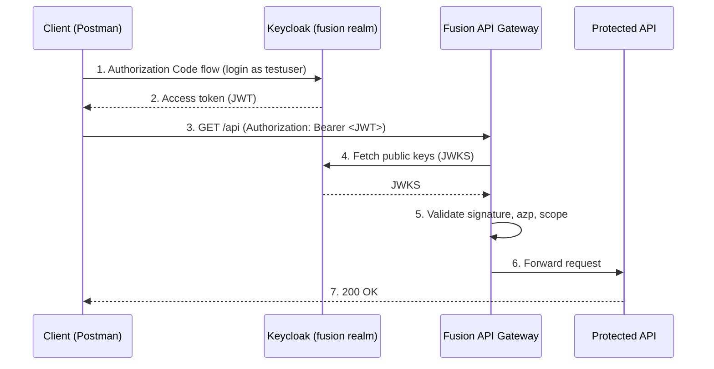
```mermaid
sequenceDiagram
    participant Client as Client (Postman)
    participant KC as Keycloak (fusion realm)
    participant Fusion as Fusion API Gateway
    participant API as Protected API

    Client->>KC: 1. Authorization Code flow (login as testuser)
    KC-->>Client: 2. Access token (JWT)
    Client->>Fusion: 3. GET /api  (Authorization: Bearer <JWT>)
    Fusion->>KC: 4. Fetch public keys (JWKS)
    KC-->>Fusion: JWKS
    Fusion->>Fusion: 5. Validate signature, azp, scope
    Fusion->>API: 6. Forward request
    API-->>Client: 7. 200 OK
```

In this set of labs, you will learn the following:

- How to create a Keycloak realm, an OpenID Connect client, and a test user
- How to create a Fusion API from an OpenAPI specification (OAS)
- How to register Keycloak as an Identity Provider in Fusion and create a Governance Rule that validates OAuth 2.0 JWT tokens
- How to apply that rule to an API and register a Consumer Application
- How to obtain a token with Postman and successfully call the protected API

## Prerequisites

- A running **Keycloak** instance with administrator access. Please note that installation of Keycloak is not covered in this lab. You could use a this [repo](https://github.com/lbrenman/keycloak-dev-codespace) if you do not want to install Keycloak and use github codespace. The requirement is a github account. 
- Access to Amplify Fusion
If you do not have an account and need one, please send an email to amplify-fusion-training@axway.com with the subject line Amplify Integration Training Environment Access Request
- The sample OpenAPI specification **`EmployeeDirectoryAPI-OAS.yaml`** (saved next to this document) used to create the API in Lab 2
- **Postman** (desktop or web) to run the OAuth 2.0 Authorization Code flow and test the API

---

## Lab 1 - Set up Keycloak (realm, client, user)

In this lab, we will prepare Keycloak so it can issue tokens for our API: a dedicated realm, a confidential OpenID Connect client, and a login-ready test user.

### Step 1 - Log in to the Keycloak Admin Console

Open your Keycloak URL and sign in to the Admin Console with your administrator credentials.

- URL: `https://keycloakIP`

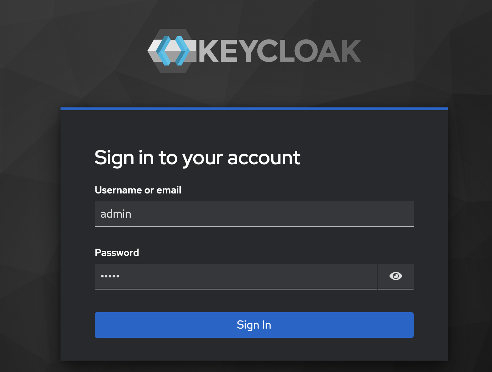

### Step 2 - Create the `fusion` realm

The `master` realm is reserved for administering Keycloak itself, so we create a separate realm for API access.

1. In the left menu, click **Manage realms**, then click **Create realm**

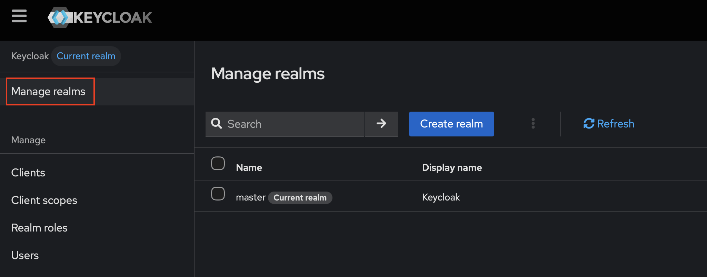

2. In the **Create realm** dialog, set **Realm name** to `fusion` and leave **Enabled** **On**
3. Click **Create**
   
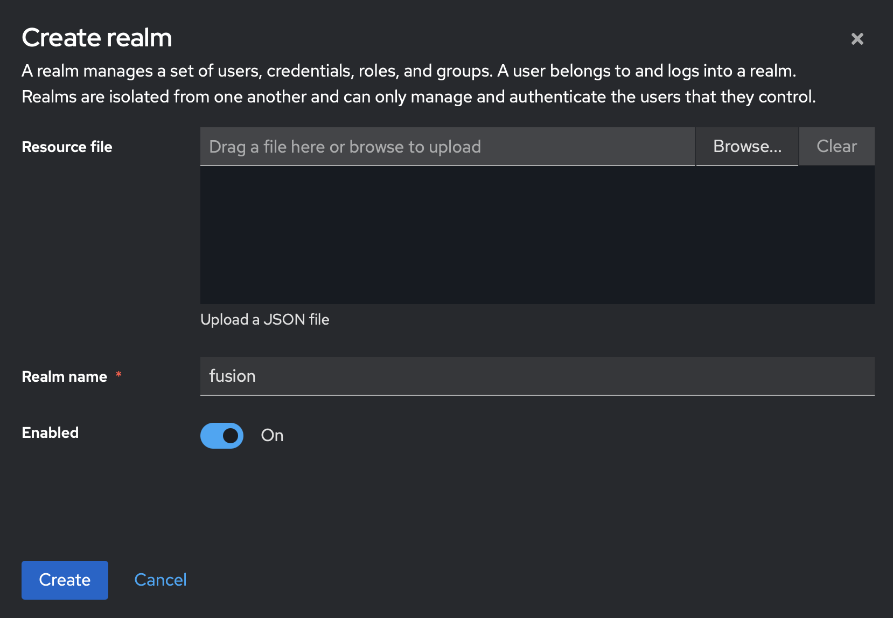

Make sure the realm selector now shows `fusion` before continuing - every step from here happens inside the `fusion` realm, not `master`.

### Step 3 - Create the `fusion_api` client (General settings)

1. In the left menu, go to **Clients** and click **Create client**
2. **Client type**: `OpenID Connect`
3. **Client ID**: `fusion_api`
4. Click **Next**
   
   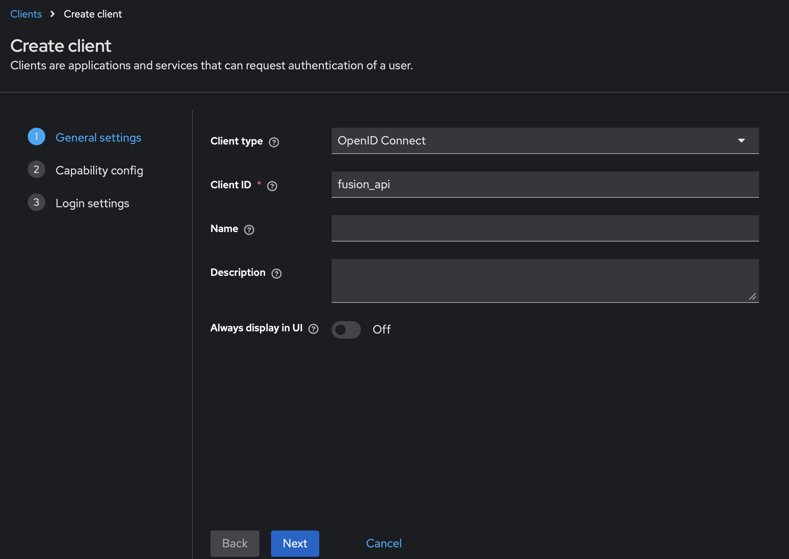
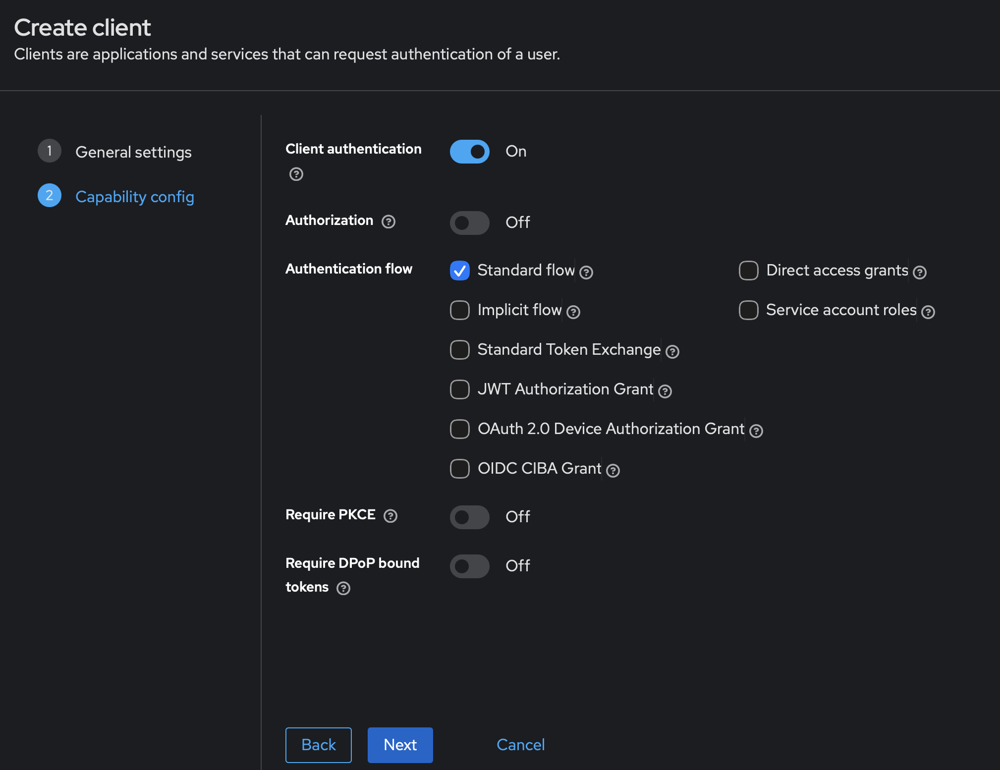

1. Turn **Client authentication** **On** — this makes the client *confidential*, so it gets a client secret (required because we use the Authorization Code flow, not a public flow)
2. Under **Authentication flow**, check **Standard flow** (this is the Authorization Code grant)
3. Leave Direct access grants and Service accounts unchecked.
4. Click **Next**
   

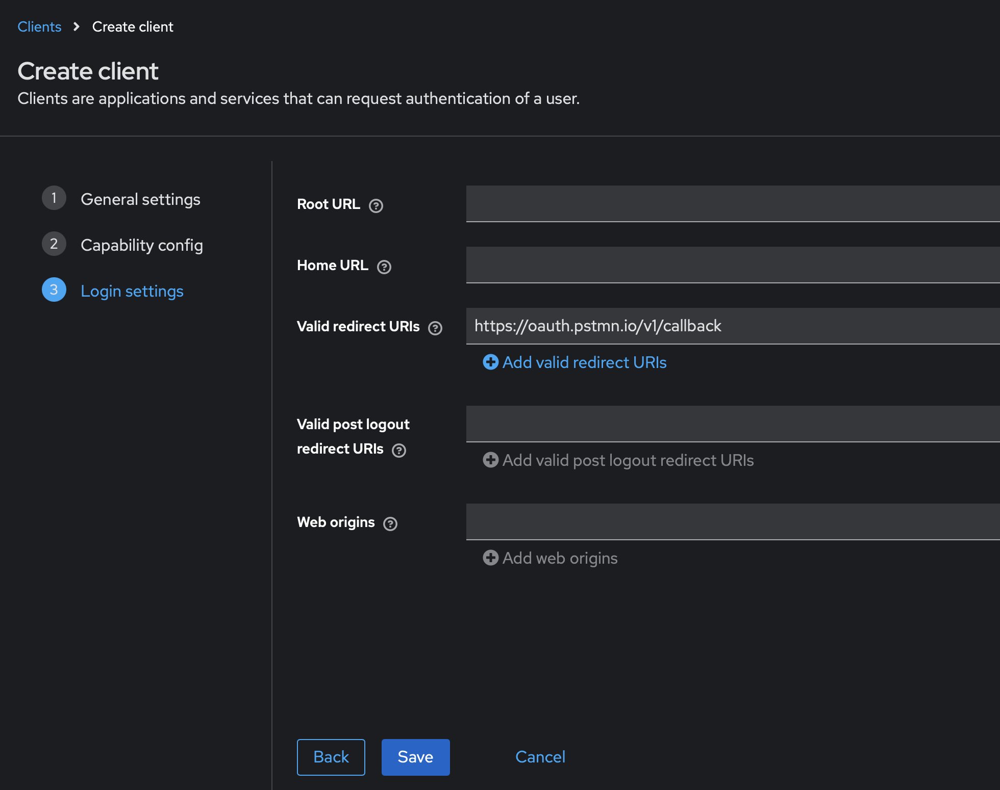

### Step 4 - Configure login settings

1. Set **Valid redirect URIs** to Postman's OAuth callback:
   - `https://oauth.pstmn.io/v1/callback` as we will be using Postman to call our API
2. Click **Save**

### Step 5 - Create a test user

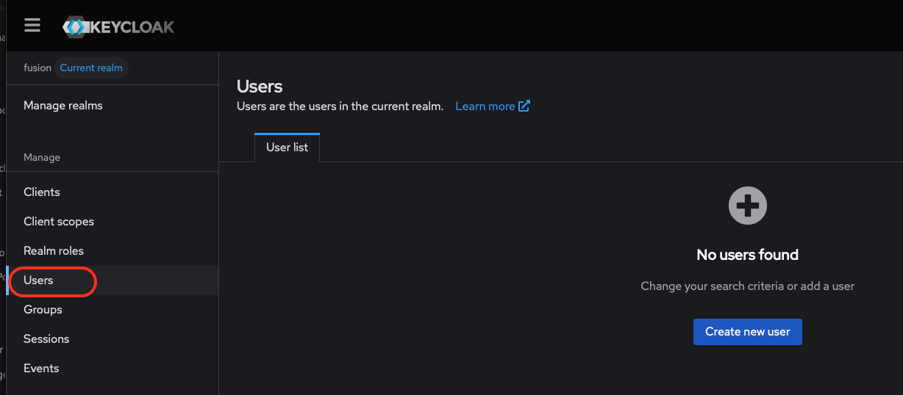

1. In the left menu, go to **Users** and click **Add user**
2. Leave the Required User actions blank
3. **Username**: `testuser`
4. **Email**: `testuser@axway.com`
5. **First name**: `Test`
6. **Last name**: `User`
7. Turn **Email verified** **On**
8. Click **Create**

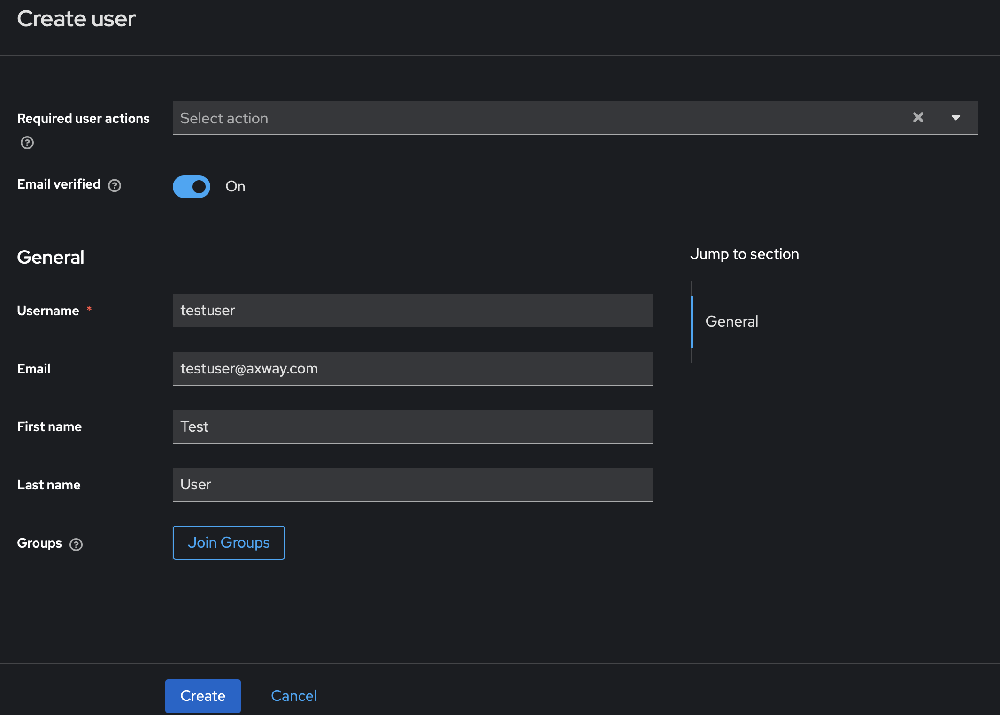

> **Important - avoid a broken login flow:** Fill in the full profile (email, first name, last name) and mark the email verified. If any of these are missing, Keycloak forces an **Update Profile** screen during login, which interrupts Postman's Authorization Code flow so no token is ever returned.

### Step 6 - Set the user's password

1. On the user's page, open the **Credentials** tab and click **Set password**
2. Enter a password (for example `Test1234`)
3. Turn **Temporary** **Off**
4. Click **Save** and confirm

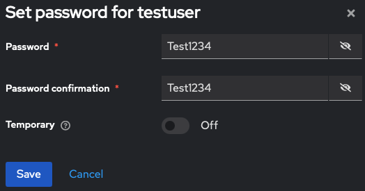

> **Important:** Leave **Temporary = Off**. If it is On, Keycloak forces a password change on first login, which — just like a missing profile — interrupts Postman's Authorization Code flow and prevents a token from being issued.

At the end of Lab 1 you have: a `fusion` realm, a confidential `fusion_api` client with a known client secret, and a login-ready `testuser`.

---

## Lab 2 - Create the Employee Directory API in Fusion

In this lab, we will create the Employee Directory API in Fusion Designer by importing an OpenAPI specification (OAS), then link a simple integration to the `GET /employees` operation so the API returns a response. In the next lab we will protect it with OAuth 2.0.

You will import this OAS file (saved next to this document): **`EmployeeDirectoryAPI-OAS.yaml`**. It defines the two read operations from our use case (`GET /employees` and `GET /employees/{id}`).

### Step 1 - Create a Fusion project

Create a new Amplify Fusion project for this lab. Use a unique name if you share the tenant with others (for example `XX_EmployeeDirectory`, where `XX` is your initials). Provide a meaningful description. Choose Project Type as Fusion. 

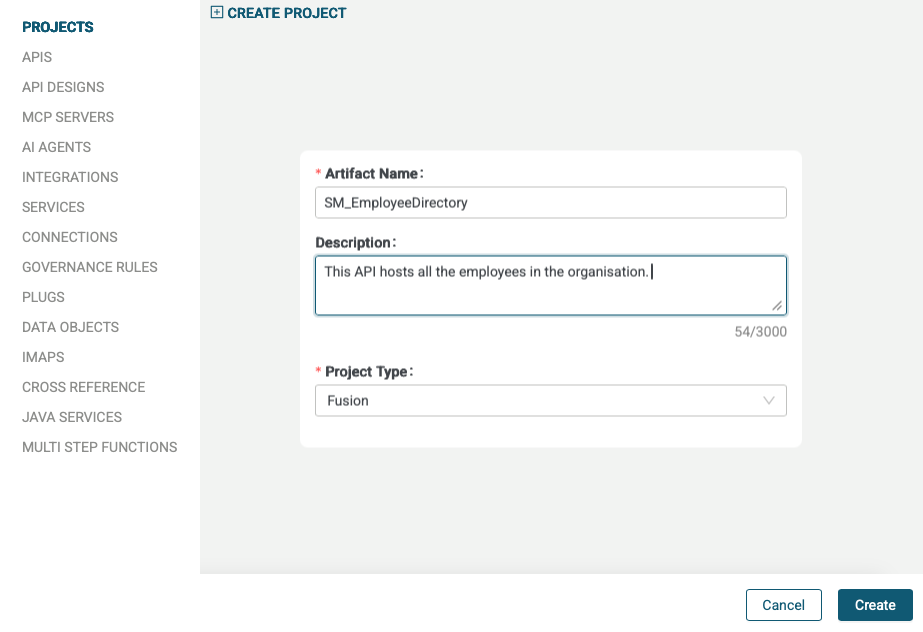

### Step 2 - Create a new API

In your project, click the **+** symbol next to API to start creating a new API.

### Step 3 - Import the OpenAPI specification

1. Give the API a name (for example `EmployeeDirectoryAPI`)
2. Upload the OpenAPI specification [`EmployeeDirectoryAPI-OAS.yaml`](EmployeeDirectoryAPI-OAS.yaml)
3. Click **Next**

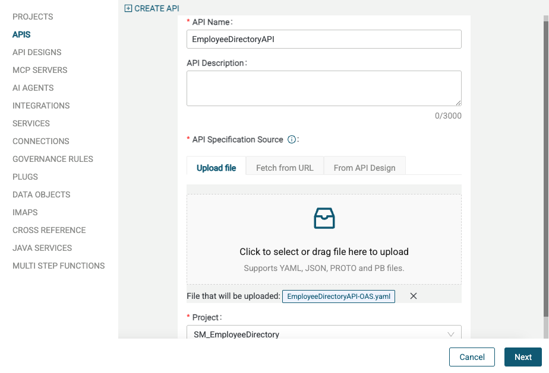

### Step 4 - Finish creating the API

1. Leave the **Backend Server URL** blank (our integration produces the response, so there is no backend to proxy to)
2. Click **Create**

### Step 5 - Set the API Frontend Base Path

Open the API **Configuration** dialog and, on the **General** tab, set a unique **Frontend Base Path** (for example `/XX_employees`) and click **Save**. This base path becomes part of the URL you will call later.

Leave **Backend Connection** empty (our integration produces the response, so there is no backend to proxy to).

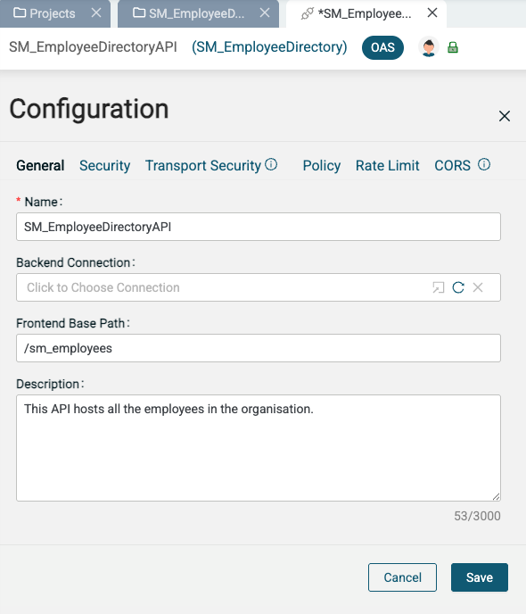

### Step 6 - Link an integration to `GET /employees`

1. For the **`GET /employees`** endpoint, click the **link integration** button on the right side of the method title. Then click on ***Create New Integration***
2. Type a name for the new integration (for example `GetEmployees`) and click **LinkIntegration**

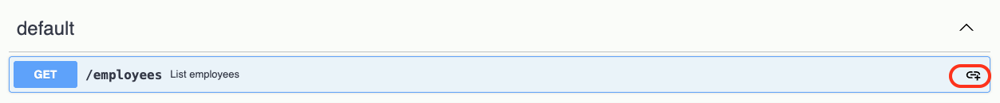

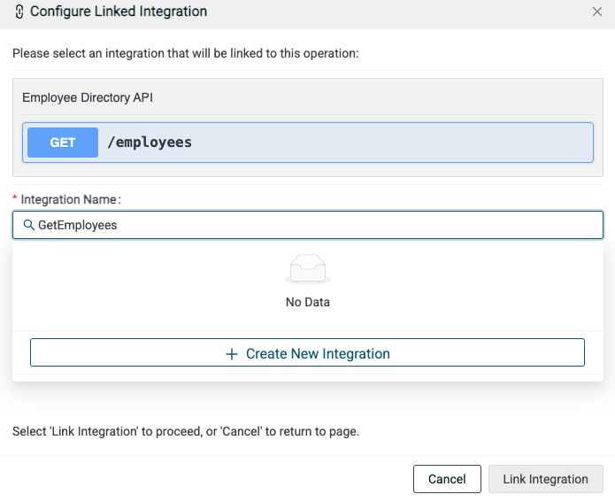

### Step 7 - Set a response

The integration tab opens automatically. For this lab we return a simple, static response so the API works end to end before we add security. We do this with a **Map** component that sets values directly on the API response. (You can later replace this with a database or backend lookup)

1. Expand the **Operations** component to see the integration flow
2. Add a **Map** component by clicking the **+** symbol after the **API Server** component
3. Set the label of the Map component as **Set Response Values**
4. Set the label of API Server as **Trigger**

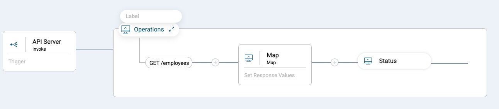

5. Click on the Map component and maximise the **Map** component to open its mapping panel
   
   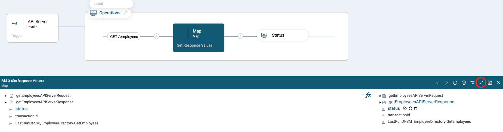

6. On the **pipe-out** (right-hand side), set the response **status** to `200`. Then expand `getEmployeesAPIServerResponse` and set the following values. Right-click each field and choose **Set Value**:

   | Pipe-out field | Value |
   |---|---|
   | `200 -> headers -> Content-Type` | `application/json` |
   | `200 -> body -> success` | `true` |
   | `200 -> body -> employees -> id` | `1` |
   | `200 -> body -> employees -> firstName` | `Test` |
   | `200 -> body -> employees -> lastName` | `User` |
   | `200 -> body -> employees -> title` | `Mr` |
   | `200 -> body -> employees -> department` | `Engineering` |
   | `200 -> body -> employees -> email` | `testuser@axway.com` |
   | `200 -> body -> employees -> phone` | `1234-123-123` |

7. Click **Save**

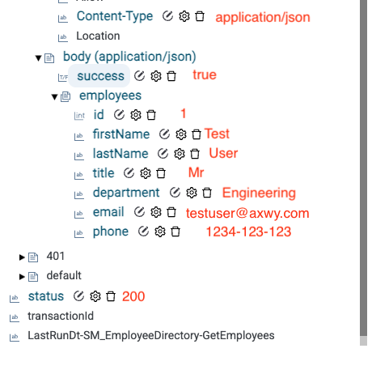

Close the Map component by clicking on the **X** button.

### Step 8 - Enable and test the API

Click on the API description and activate the API by clicking on the **Activate** button. Copy the URL of the API, which you will use to call the API from Postman.

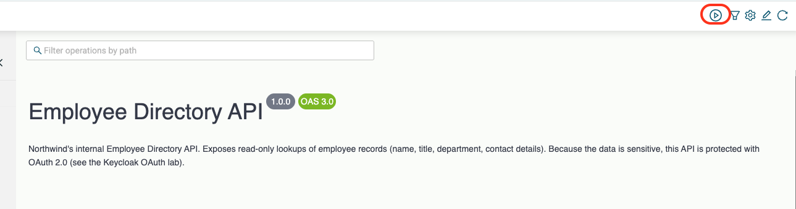

> **Note:** At this point the API is **unprotected** - anyone with the URL can call it and get employee data back. That is the problem we solve in Lab 3 by requiring a valid Keycloak token. Testing it now (open, returning `200`) confirms the API itself works before we layer security on top, so if something breaks later we know it is the OAuth configuration and not the API.

At the end of Lab 2 you have a working (but open) Employee Directory API that returns a `200` with employee data.

**Test your API in Postman**

Use the URL with the method name (`employees`) appended at the end. You should get the response with the values you populated earlier.

---

## Lab 3 - Protect the API in Fusion

In this lab, we will create an **Identity Provider** in Fusion that validates Keycloak JWTs, apply it to the API as inbound OAuth 2.0 security, and register a Consumer Application so Fusion trusts the client id in the token.

### Step 1 - Get the endpoint values from Keycloak's OpenID Endpoint Configuration

Before configuring Fusion, gather the OAuth/OIDC endpoint URLs that the `fusion` realm publishes. Keycloak exposes these in its **OpenID Endpoint Configuration** (the OIDC discovery document).

1. In the Keycloak Admin Console, make sure the realm selector shows **`fusion`**
2. Go to **Realm settings** → scroll to **Endpoints**
3. Click **OpenID Endpoint Configuration** — this opens the discovery JSON

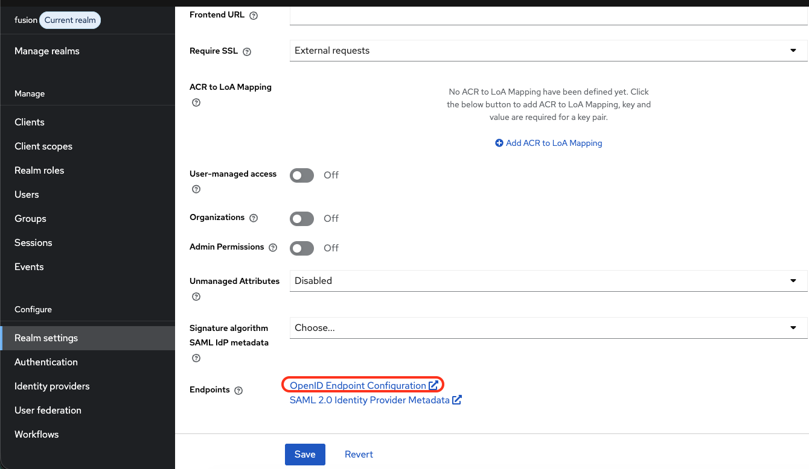

From that JSON, note the following values (for the `fusion` realm they follow the standard Keycloak paths):

| Purpose | Field in the discovery doc | Value |
|---|---|---|
| JWKS | `jwks_uri` | `https://<hostname>/realms/fusion/protocol/openid-connect/certs` |
| Token URL | `token_endpoint` | `https://<hostname>/realms/fusion/protocol/openid-connect/token` |
| Authorization URL | `authorization_endpoint` | `https://<hostname>/realms/fusion/protocol/openid-connect/auth` |

> **Tip:** Replace `<hostname>` and the realm name with your own values. Reading them from the discovery doc (rather than hand-building the URLs) avoids typos and picks up any non-standard paths your Keycloak might use.

### Step 2 - Create the Identity Provider in the Manager module

Fusion validates incoming tokens against an **Identity Provider** definition. We create one for our Keycloak `fusion` realm.

In Fusion
1. Go to the **Manager** module
2. Open the **Identity Providers** sub-window
3. Click to add a new Identity Provider

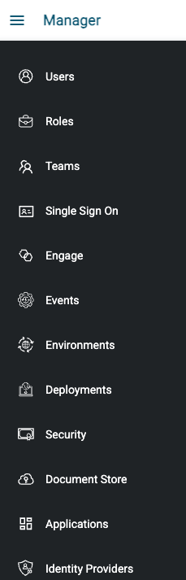

Fill in the Identity Provider form:

- **Name**: a descriptive name, for example `Keycloak-Fusion`
- **Description**: optional, for example `Keycloak fusion realm`
- **Token Validation Type**: select **JWT Validation**

Under **JWT Token Validation**, using the values from Step 1:

- **JWKS**: `https://<hostname>/realms/fusion/protocol/openid-connect/certs`
- **Client Id Claim**: `azp`
- **Scope Claim**: `scope`

> **Important - change the claim defaults (`cid`/`scp`):** This screen pre-fills **Client Id Claim** with **`cid`** and **Scope Claim** with **`scp`**. Keycloak does **not** use those names — it puts the client id in **`azp`** and the scopes in **`scope`**. If you leave the defaults, Fusion looks for claims that do not exist in the token, never finds a client id to match, and rejects every request with a **401**. Change them to `azp` and `scope`.

### Step 3 - Add the OAuth 2.0 Flow

Still on the Identity Provider form, under **OAuth 2.0 Flows**, add the Authorization Code flow using the URLs from Step 1:

1. **Type**: select **Authorization Code**
2. **Token URL**: `https://<hostname>/realms/fusion/protocol/openid-connect/token`
3. **Authorization URL**: `https://<hostname>/realms/fusion/protocol/openid-connect/auth`
4. Leave **Refresh URL** blank (Keycloak reuses the token endpoint for refresh)
5. Click **Add Flow**, then **Save** the Identity Provider

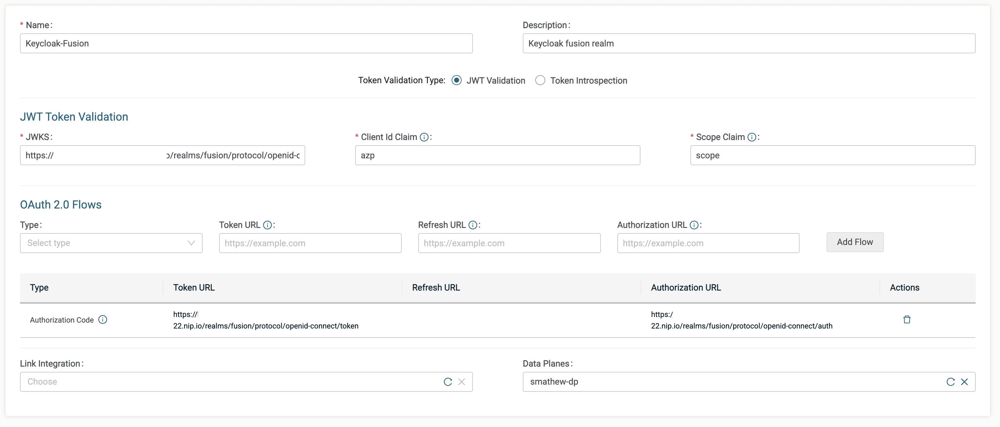

> **Important - use the `fusion` realm, not `master`:** Make sure these URLs contain `/realms/fusion/`. The `master` realm is for administering Keycloak itself; issuing API tokens from it would mix admin accounts with API access.

### Step 4 - Set inbound security and create the Governance Rule

Go back to the Designer and diable the API if you have enabled it. Then in the API's **Security** tab uses a **Governance Rule** for inbound security. The Governance Rule references the Identity Provider we created in Steps 2-3.

1. Open the **EmployeeDirectoryAPI** **Configuration** dialog and select the **Security** tab (the same dialog as the General tab where you set the base path in Lab 2)
2. Set **Inbound Security** to **OAuth 2.0 (JWT Validation)**
3. In the **Governance Rule** field, click **+ Create Governance Rule**

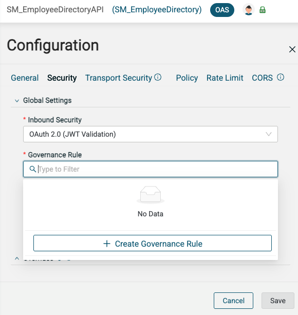

4. In the **Create OAuth 2.0 (JWT Validation)** dialog, fill in:
   - **Name**: `OAuth_GovernanceRule`
   - **Encrypted Token (JWE)**: leave unchecked (Keycloak issues standard signed JWTs, not encrypted tokens)
   - **Identity Providers**: select the Identity Provider you created in Step 2, `Keycloak-Fusion`
   - **JWKS URI**: auto-fills from the selected Identity Provider — leave it as-is
5. Click **Create**

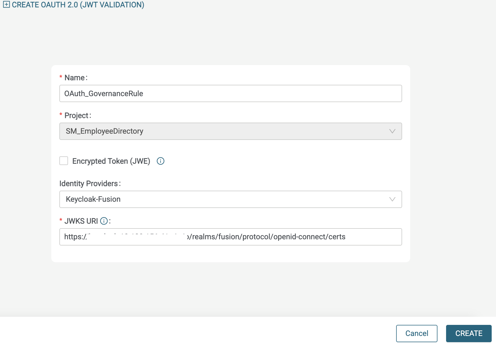

6. Back on the **Security** tab, make sure the **Governance Rule** field now shows `OAuth_GovernanceRule`, then **Save**

> **Note:** If the API is currently enabled, you may need to disable it before changing security, then re-enable it in Step 7.

### Step 5 - Configure required scopes

On the same **Security** tab, use **Configure Scopes** → **+ Add scope** to require a scope on the token.

- Add the scope `openid`

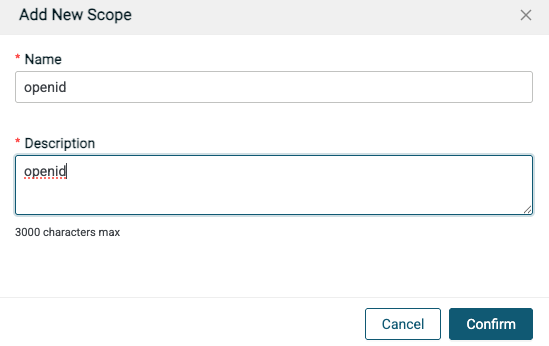

> **Note - required scopes must actually be in the token:** Adding `openid` here means the token's `scope` claim must include `openid`, otherwise the call is rejected. Configuring the scope in Fusion does **not** make Keycloak grant it — the client has to *request* it. We handle this in Lab 4 by setting Postman's **Scope** field to `openid`. If you would rather accept any validly signed token from this realm, leave Configure Scopes empty instead.

### Step 6 - Register a Consumer Application

Fusion matches the client id in the token against a registered Consumer Application.

1. Go to the **Manager** module → **Applications**
2. Create an application (for example `oauthApp`)
3. Choose your data plane and click **Apply**
4. Choose the API that we created (`EmployeeDirectoryAPI`) and click **Apply**
5. Click **+ OAuth 2.0 credentials --> + OAuth 2.0**, provide a name, and set the **Client ID** to `fusion_api` (the same client id from Lab 1)
6. Click **Update**

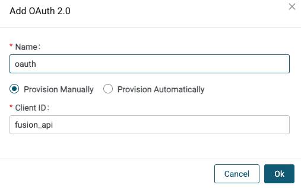

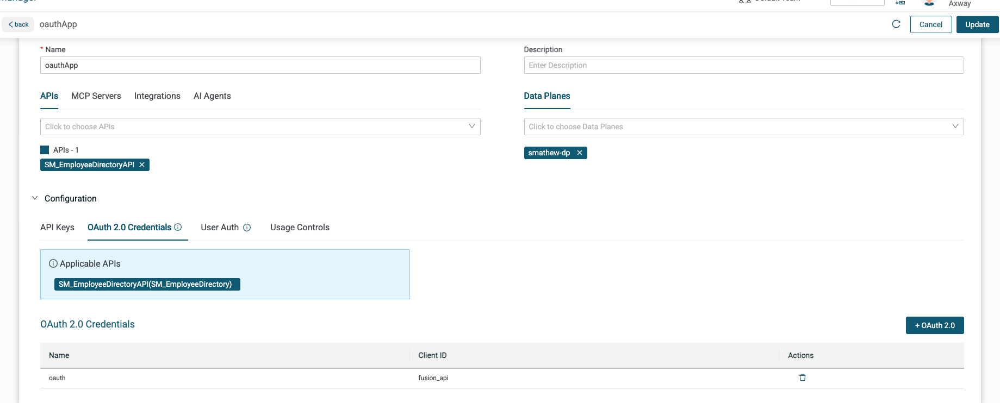

### Step 7 - Activate / deploy the API

Activate the API (or re-activate it) on your data plane so the new security configuration takes effect.

At the end of Lab 3, the API requires a valid Keycloak JWT: the signature must verify against the `fusion` realm JWKS, the `azp` claim must match the `fusion_api` Consumer Application, and the `scope` claim must include `openid`.

---

## Lab 4 - Test with Postman

In this lab, we will obtain an access token from Keycloak using the Authorization Code flow and call the protected API.

### Step 1 - Configure the OAuth 2.0 request in Postman

In your request's **Authorization** tab, set **Type** to **OAuth 2.0**, then under **Configure New Token** enter:

| Field | Value |
|---|---|
| Grant Type | Authorization Code |
| Callback URL | `https://oauth.pstmn.io/v1/callback` |
| Auth URL | `https://<hostname>/realms/fusion/protocol/openid-connect/auth` |
| Access Token URL | `https://<hostname>/realms/fusion/protocol/openid-connect/token` |
| Client ID | `fusion_api` |
| Client Authentication | Send as Basic Auth header |
| Scope | `openid` |

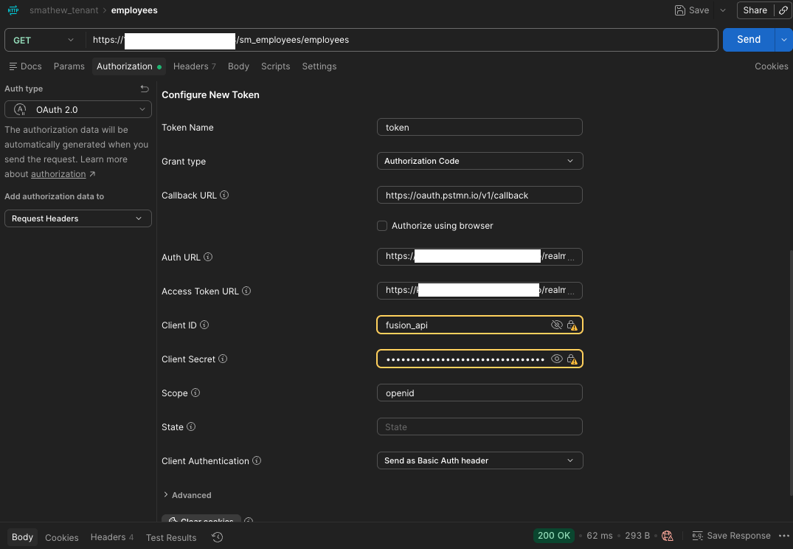

> **Important - set the Scope field to `openid`:** Keycloak only includes scopes in the token that were explicitly requested. If you leave Postman's **Scope** field blank, Keycloak grants only its defaults (`profile email`) and the token's `scope` claim will not contain `openid` — which fails the requirement you set in Lab 3, Step 5. Enter `openid` here so the issued token carries it.

### Step 2 - Get a new access token and log in

1. Click **Get New Access Token**
2. Keycloak's login page opens — sign in as `testuser` with the password you set in Lab 1 (Test1234)

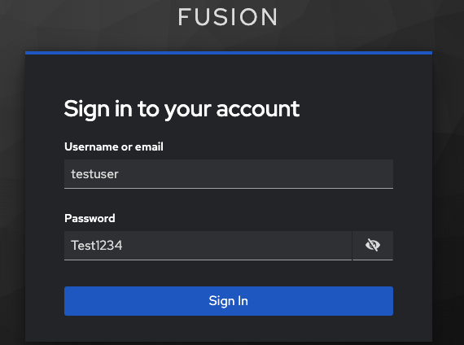

### Step 3 - Inspect the token

After login, Postman receives the token. Inspect it (for example at [jwt.io](https://jwt.io)) and confirm:

- `azp` is `fusion_api`
- `scope` includes `openid` (for example `"scope": "openid profile email"`)
- `iss` is `https://<hostname>/realms/fusion`

### Step 4 - Call the protected API
1. Use the token as the request's Bearer token (Postman does this automatically once the token is active)
2. Send the request to the Employee Directory API's `GET /employees` endpoint (the URL from Lab 2, Step 8, with `/employees` appended)
3. You should receive a **200 OK** response with the employee data

A 200 confirms the full chain works: Postman obtained a token from Keycloak, Fusion validated the JWT against the realm JWKS, matched `azp` against the `fusion_api` Consumer Application, verified the `openid` scope, and let the request through.

---

## Summary

You have built and protected the Employee Directory API end to end with OAuth 2.0 and Keycloak:

- **Lab 1** — created the `fusion` realm, a confidential `fusion_api` client, and a login-ready `testuser`
- **Lab 2** — created the Employee Directory API from an OpenAPI specification and linked an integration that returns employee data
- **Lab 3** — created a Keycloak Identity Provider in Fusion (JWT Validation with the correct `azp` / `scope` claim names and the OAuth 2.0 flow), applied it to the API, required the `openid` scope, and registered the `fusion_api` Consumer Application
- **Lab 4** — obtained a token with Postman's Authorization Code flow and received a 200 from the protected API